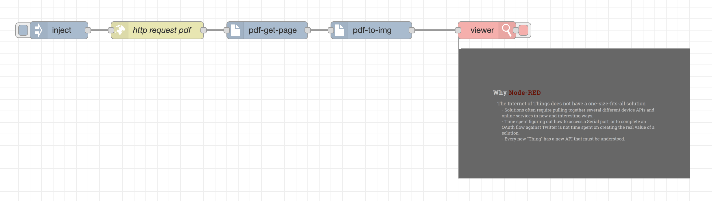
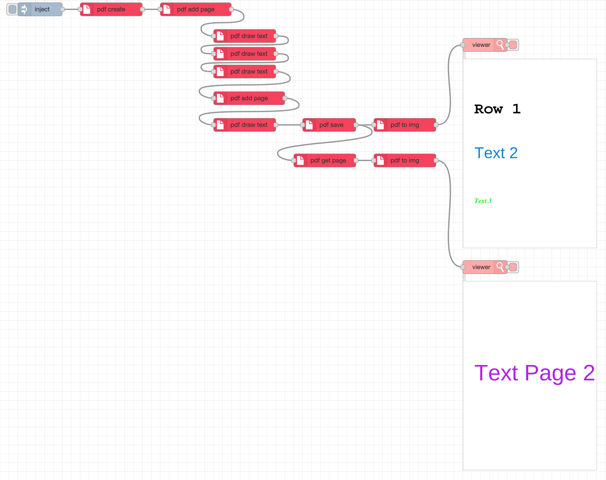

## Important Information

Your support in the ongoing development of this library would be sincerely appreciated. 🙂

[](https://buymeacoffee.com/mazuralbert)

_**The library requires testing and monitoring of RAM usage.**_

# @aaqu/node-red-aaqu-pdf

A [Node-RED](https://nodered.org/) node for operating on a PDF document.

This module provides a custom Node-RED node that:
- get single page from pdf
- display single page in flow

Get single page form pdf (file, http)


Display page in flow - need [node-red-contrib-image-tools](https://flows.nodered.org/node/node-red-contrib-image-tools) -> viewer



Create empty PDF and draw text



---

## Features

- Create empty PDF and draw text
- Select a single page from pdf to buffer
- Convert PDF page buffer to base64 image

---

## Installation

Run the following command inside your Node-RED user directory (typically `~/.node-red`):

```bash
npm install @aaqu/node-red-aaqu-pdf
```

Then restart Node-RED and the new node will appear in the editor palette.

---

## Nodes usage
#### pdf get page


- **msg.payload** - pdf buffer
- **msg.pdfPage** – optional runtime override for the page number (starting at `1`).

```text
pdf multi page buffer → [pdf get page] → pdf single page buffer
```

where:
- **pdf multi page buffer** input multi page buffer.
- **pdf get page** extracts the configured page (or the page defined in `msg.pdfPage`) default page no 1.
- **pdf single page buffer** return single page buffer.


#### pdf to img


- **msg.payload** - pdf buffer input

```text
pdf buffer → [pdf to img] → out base64
```

where:
- **pdf buffer** a pdf file as buffer.
- **pdf to img** extracts the page to image.
- **out base64** return image in base64 (to display use node-red-contrib-image-tools -> viewer).

#### pdf create


create PDF document

#### pdf add page


adding a page

#### pdf save


buil final PDF

#### pdf draw text


add text to page PDF

---

## Use cases

- Fast display pdf in flow editor.
- Extracting pages from automatically generated reports.
- Preparing single-page documents for downstream processing.
- Splitting large PDFs into smaller parts.
- Creating lightweight attachments for email or APIs.

---

## License

Apache-2.0 
