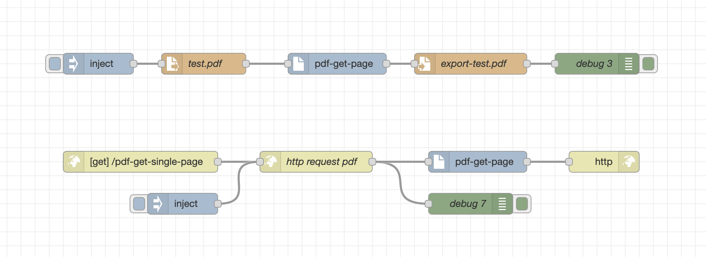

## Important Information

Your support in the ongoing development of this library would be sincerely appreciated. 🙂
[](https://buymeacoffee.com/mazuralbert)
# @aaqu/node-red-aaqu-pdf

A [Node-RED](https://nodered.org/) node for extracting a single page from a PDF document.

This module provides a custom Node-RED node that takes a **PDF buffer** as input and outputs a **new PDF buffer** containing only the specified page.



---

## Features

- Accepts a PDF document as a `Buffer` in `msg.payload`.
- Page number can be set either in the **node configuration** or dynamically via `msg.pdfPage`.
- Outputs a new `Buffer` containing a PDF with only the selected page.
- Simple integration with existing Node-RED flows.

---

## Installation

Run the following command inside your Node-RED user directory (typically `~/.node-red`):

```bash
npm install @aaqu/node-red-aaqu-pdf
```

Then restart Node-RED and the new node will appear in the editor palette.

---

## Usage

1. Provide a PDF file (e.g., using the **file in** node).
2. Pass the PDF buffer to the **aaqu-pdf** node.
3. Configure the page number in the node’s settings, or pass it dynamically using `msg.pdfPage`.
   > **Note:** Page numbering starts from `1`.
4. The node will return a new PDF buffer containing only the requested page.

### Example Flow

```text
[file in] → [aaqu-pdf] → [file out]
```

Where:
- **file in** reads the original PDF into `msg.payload` (as a buffer).
- **aaqu-pdf** extracts the configured page (or the page defined in `msg.pdfPage`).
- **file out** writes the single-page PDF back to disk.

---

## Configuration

- **msg.payload** - pdf buffer
- **msg.pdfPage** – optional runtime override for the page number (starting at `1`).

---

## Use cases

- Extracting pages from automatically generated reports.
- Preparing single-page documents for downstream processing.
- Splitting large PDFs into smaller parts.
- Creating lightweight attachments for email or APIs.

---

## License

Apache-2.0 
